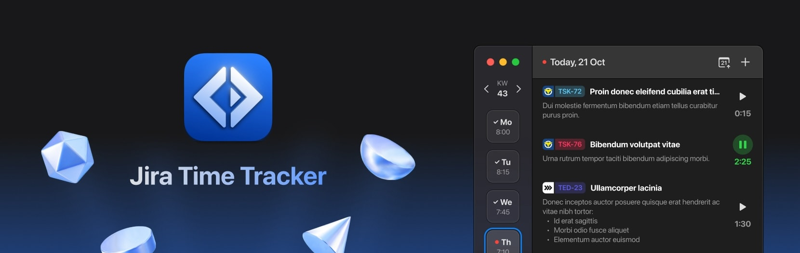

**Jira Time Tracker** is an app to track time spent on Jira issues. It is built with React Native and will soon be available for MacOS and Windows.
The project is still in development, we got an open beta for MacOS though.
You can join the beta by following the instructions [here](https://testflight.apple.com/join/mB7ZA6s5).

## Development

### Debug starting issues

Sometimes the dev environment will not start after updating packages or other external dependencies.
A good try to fix this is to do a hard clean install and build using this command:

```bash
npm run fix-repo
```
