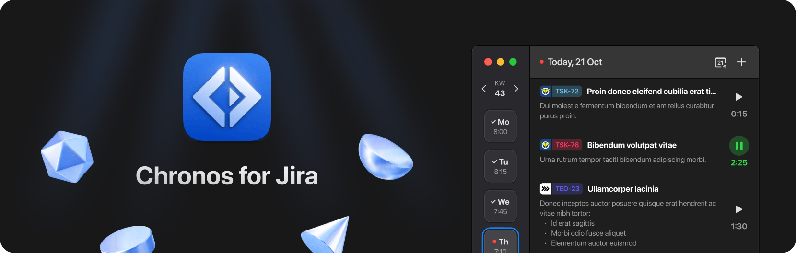

**Chronos for Jira** is an app to track time spent on Jira issues. It is built with React Native and will soon be available for MacOS and Windows.
The project is still in development, we got an open beta for MacOS though.
You can join the beta by following the instructions [here](https://testflight.apple.com/join/mB7ZA6s5).

## Getting started

To start the project you first have to install the dependencies:

```bash
npm install
npx pod-install ios
npx pod-install macos
```

After that you can start the development server.
This will launch the Metro bundler which creates the JavaScript bundle for the app.

```bash
npm start
```

Once your Metro bundler is running, you can start the app by opening the Xcode project (`Chronos.xcworkspace`) in the `macos` directory and starting the app from within Xcode.
The Xcode project contains two schemes: `Chronos-macOS` for development and `Chronos-macOS-prod` for the production build.

## Common issues

### React Native Debugger

It is recommended to use the React Native Debugger for development. You can download it [here](https://github.com/jhen0409/react-native-debugger).

### Debug starting issues

Sometimes the dev environment will not start after updating packages or other external dependencies.
The reason for that is that can be outdated packages, cache issues or other problems. This commands will help you to solve the most common issues:

```bash
npm run clear-cache
```

### Metro bundler not starting

Sometimes the Metro bundler will not start because of too many open files and the following error will be shown:

```
Error: EMFILE: too many open files, watch
```

This can be solved by installing `watchman` globally and clearing the watchman cache:

```bash
brew install watchman
watchman shutdown-server
watchman watch-del-all
```

### Errors after upgrading react-native

Getting errors after upgrading react-native is a common issue. A good starting point is to check the [react-native upgrade helper](https://react-native-community.github.io/upgrade-helper/) and follow the instructions there.
